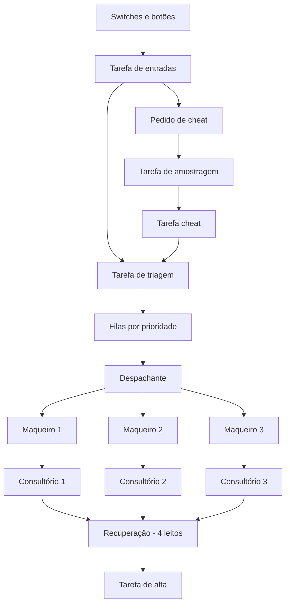

# Hospital Automatizado com ESP32 e FreeRTOS

## Visão geral

Este projeto implementa, no simulador **Wokwi**, um hospital automatizado executado em uma placa **ESP32 DevKit V1** com **FreeRTOS**.

O sistema possui:

- 3 consultórios;
- 3 maqueiros;
- 4 leitos de recuperação;
- triagem por prioridade;
- modos automático, manual e teste;
- sinalização por LEDs;
- sincronização do cheat com uma tarefa periódica.

## Simulador e montagem

A simulação foi desenvolvida no **Wokwi**. O arquivo `diagram.json` define o ESP32, switches, botões, LEDs, resistores e analisador lógico.


## Implementação

O sistema não utiliza um mutex global controlando todo o hospital. A comunicação entre as tarefas ocorre por:

- **filas:** pacientes, trabalhos, recursos livres e mensagens;
- **semáforo contador:** reserva e liberação dos quatro leitos;
- **Event Group:** estados dos consultórios e pedido de cheat;
- **notificações:** ativação do despachante, triagem, alta e cheat;
- **`vTaskDelayUntil()`:** tarefas periódicas de entrada, amostragem e sinalização.

Também foram implementados:

- uma fila individual para cada maqueiro;
- distribuição equilibrada dos transportes;
- debounce dos botões;
- envelhecimento de prioridade;
- logging assíncrono;
- monitor simples do estado do hospital.

## Arquitetura das tarefas



| Tarefa | Função |
|---|---|
| `tEntradas` | Lê switches e botões com debounce |
| `tTriagem` | Cria e classifica pacientes |
| `tDespachante` | Distribui transportes |
| `tMaqueiro` | Executa os transportes |
| `tConsultorio` | Realiza os atendimentos |
| `tAlta` | Libera pacientes da recuperação |
| `tAmostragem` | Gera o pulso periódico |
| `tCheat` | Executa o cheat sincronizado |
| `tSinalizacao` | Atualiza os LEDs |
| `tLogger` | Envia mensagens ao monitor serial |
| `tMonitor` | Exibe o estado geral do sistema |

## Modos de operação

| Modo 1 | Modo 0 | Funcionamento |
|---:|---:|---|
| 0 | 0 | Automático |
| 0 | 1 | Manual |
| 1 | 0 | Teste/Cheat |
| 1 | 1 | Reservado |

### Automático

Pacientes e altas são gerados em intervalos aleatórios.

### Manual

O botão `PACIENTE` gera uma nova entrada e o botão `ALTA` libera um paciente da recuperação.

### Teste/Cheat

O botão `CHEAT` solicita um paciente vermelho de prioridade máxima.

## Sincronização do cheat com a amostragem

O cheat não é executado diretamente no instante do botão.

1. A tarefa de entradas registra `BIT_CHEAT` no `Event Group`.
2. A tarefa de amostragem executa periodicamente com `vTaskDelayUntil()`.
3. No pulso seguinte, ela detecta o bit e notifica `tCheat`.
4. `tCheat` solicita a criação do paciente vermelho na triagem.

```text
Botão CHEAT
    ↓
BIT_CHEAT pendente
    ↓
Próximo pulso de amostragem
    ↓
Notificação de tCheat
    ↓
Paciente vermelho inserido
```

O analisador lógico monitora:

- pedido do cheat;
- pulso de amostragem;
- execução do cheat.

## Triagem e envelhecimento de prioridade

| Cor | Prioridade |
|---|---:|
| Vermelho | 1 |
| Laranja | 2 |
| Azul | 3 |

Para impedir espera indefinida:

- azul passa a laranja após 15 s;
- azul passa a vermelho após 30 s;
- laranja passa a vermelho após 20 s.

## Evidências dos três modos

As capturas abaixo devem mostrar o LED correspondente ao modo e as mensagens do monitor serial.

### Modo automático

<!-- Substitua o arquivo abaixo pela captura real do modo automático. -->


### Modo manual

<!-- Substitua o arquivo abaixo pela captura real do modo manual. -->


### Modo teste

<!-- Substitua o arquivo abaixo pela captura real do modo teste. -->


### Sincronização do cheat

<!-- Adicione uma captura do analisador lógico mostrando pedido, amostragem e execução. -->


## Como executar

1. Crie um projeto **ESP32** no Wokwi.
2. Copie `sketch.ino` para o editor de código.
3. Copie `diagram.json` para o editor do circuito.
4. Inicie a simulação.
5. Selecione o modo pelos switches.
6. Observe os LEDs, o monitor serial e o analisador lógico.

## Relatório técnico

O relatório apresenta a arquitetura, as tarefas FreeRTOS, os modos de operação, a sincronização do cheat, os componentes e os códigos comentados.

[Baixar relatório técnico](docs/relatorio.pdf)

## Vídeo de demonstração

O vídeo deve apresentar:

- montagem no Wokwi;
- modo automático;
- modo manual;
- modo teste;
- sincronização do cheat;
- funcionamento dos maqueiros e consultórios.

[Assistir à demonstração no YouTube](COLOQUE-AQUI-O-LINK-DO-VIDEO)

## Estrutura do repositório

```text
hospital-freertos/
├── README.md
├── sketch.ino
├── diagram.json
└── docs/
    ├── relatorio.pdf
    └── capturas/
        ├── montagem-wokwi.png
        ├── modo-automatico.png
        ├── modo-manual.png
        ├── modo-teste.png
        └── sincronizacao-cheat.png
```

## Entregáveis

- [x] Código estruturado com tarefas FreeRTOS
- [x] Código comentado
- [x] Arquitetura das tarefas
- [x] Explicação da sincronização do cheat
- [x] Montagem no Wokwi
- [ ] Captura do modo automático
- [ ] Captura do modo manual
- [ ] Captura do modo teste
- [ ] Captura do analisador lógico
- [ ] Link do vídeo de demonstração

## Limitação

O Wokwi valida a lógica e a comunicação entre tarefas, mas não substitui completamente testes em um ESP32 físico.
