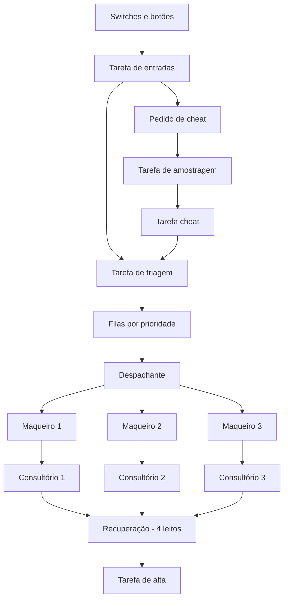

# Hospital Automatizado com ESP32 e FreeRTOS

## Visão geral

Este projeto implementa, no simulador **Wokwi**, um hospital automatizado executado em uma placa **ESP32 DevKit V1** com **FreeRTOS**.

O sistema possui:

- 3 consultórios;
- 3 maqueiros;
- 4 leitos de recuperação;
- triagem por prioridade;
- modos automático, manual e teste;
- sinalização por LEDs;
- sincronização do cheat com uma tarefa periódica.

## Simulador e montagem

A simulação foi desenvolvida no **Wokwi**. O arquivo `diagram.json` define o ESP32, switches, botões, LEDs, resistores e analisador lógico.


## Implementação

O sistema não utiliza um mutex global controlando todo o hospital. A comunicação entre as tarefas ocorre por:

- **filas:** pacientes, trabalhos, recursos livres e mensagens;
- **semáforo contador:** reserva e liberação dos quatro leitos;
- **Event Group:** estados dos consultórios e pedido de cheat;
- **notificações:** ativação do despachante, triagem, alta e cheat;
- **`vTaskDelayUntil()`:** execução periódica das tarefas de entradas, amostragem e sinalização.

Também foram implementados:

- uma fila individual para cada maqueiro;
- distribuição dos transportes entre os maqueiros disponíveis;
- debounce dos botões;
- envelhecimento de prioridade;
- logging assíncrono;
- monitor do estado do hospital.

## Arquitetura das tarefas



| Tarefa | Função |
|---|---|
| `tEntradas` | Lê os switches e botões com debounce |
| `tTriagem` | Cria e classifica os pacientes |
| `tDespachante` | Distribui os transportes |
| `tMaqueiro` | Executa os transportes |
| `tConsultorio` | Realiza os atendimentos |
| `tAlta` | Libera pacientes da recuperação |
| `tAmostragem` | Gera o pulso periódico |
| `tCheat` | Executa o cheat sincronizado |
| `tSinalizacao` | Atualiza os LEDs |
| `tLogger` | Envia mensagens ao monitor serial |
| `tMonitor` | Exibe o estado geral do sistema |

## Modos de operação

| Modo 1 | Modo 0 | Funcionamento |
|---:|---:|---|
| 0 | 0 | Automático |
| 0 | 1 | Manual |
| 1 | 0 | Teste/Cheat |
| 1 | 1 | Reservado |

## Modo automático

No modo automático, o hospital funciona sem intervenção do usuário.

A tarefa de triagem gera pacientes em intervalos aleatórios. Cada paciente recebe uma classificação de risco e é colocado na fila correspondente.

As altas também acontecem automaticamente após intervalos definidos pelo sistema. Quando uma alta é realizada, um paciente é removido da recuperação e o leito é liberado.

O fluxo executado é:

```text
Geração automática do paciente
        ↓
Triagem e classificação
        ↓
Fila por prioridade
        ↓
Transporte por um maqueiro
        ↓
Atendimento no consultório
        ↓
Transporte para recuperação
        ↓
Alta automática
```

## Modo manual

O modo manual permite controlar diretamente a entrada e a saída de pacientes durante a simulação.

Nesse modo, os eventos automáticos de chegada e alta ficam desativados. O usuário controla o sistema pelos botões da montagem:

- `PACIENTE`: solicita a criação de um novo paciente;
- `ALTA`: solicita a retirada de um paciente da recuperação;
- `CHEAT`: permanece desabilitado.

Quando o botão `PACIENTE` é pressionado, a tarefa `tEntradas` envia uma solicitação para a tarefa `tTriagem`.

A triagem cria o paciente, define sua classificação de risco e o coloca em uma das filas de prioridade:

- vermelho;
- laranja;
- azul.

O despachante aguarda a existência de:

- um paciente;
- um maqueiro livre;
- um consultório livre.

Quando esses recursos estão disponíveis, o paciente é transportado até um consultório.

Após o atendimento, o paciente aguarda um novo transporte até a recuperação. A entrada na recuperação depende da disponibilidade de um dos quatro leitos.

Quando o botão `ALTA` é pressionado, a tarefa `tAlta` tenta retirar um paciente da recuperação. Caso exista um paciente internado, o leito correspondente é liberado no semáforo contador.

O modo manual permite observar cada etapa do sistema de forma controlada:

```text
Botão PACIENTE
        ↓
Triagem
        ↓
Fila de prioridade
        ↓
Transporte pelo maqueiro
        ↓
Atendimento no consultório
        ↓
Recuperação
        ↓
Botão ALTA
```

## Modo teste

O modo teste mantém os controles manuais e adiciona a função `CHEAT`.

Nesse modo, os botões possuem as seguintes funções:

- `PACIENTE`: solicita um paciente comum;
- `ALTA`: libera um paciente da recuperação;
- `CHEAT`: solicita um paciente vermelho com prioridade máxima.

O cheat foi criado para demonstrar a sincronização entre tarefas.

Quando o botão `CHEAT` é pressionado, o paciente não é criado imediatamente. A tarefa `tEntradas` apenas registra uma solicitação pendente no `Event Group`, por meio do bit `BIT_CHEAT`.

A solicitação permanece pendente até o próximo ciclo da tarefa periódica de amostragem.

O processo ocorre da seguinte forma:

```text
Botão CHEAT pressionado
        ↓
BIT_CHEAT ativado no Event Group
        ↓
Solicitação permanece pendente
        ↓
Próximo pulso da tarefa de amostragem
        ↓
Notificação enviada para tCheat
        ↓
Paciente vermelho enviado à triagem
```

A tarefa `tCheat` envia uma solicitação especial para a triagem. O paciente criado recebe:

- classificação vermelha;
- prioridade máxima;
- identificação de paciente gerado pelo cheat.

O modo teste permite verificar:

- comunicação por `Event Group`;
- comunicação por notificações;
- sincronização com uma tarefa periódica;
- tratamento de um paciente de prioridade máxima;
- funcionamento do analisador lógico.

## Diferença entre os modos manual e teste

| Característica | Manual | Teste |
|---|---:|---:|
| Entrada pelo botão `PACIENTE` | Sim | Sim |
| Alta pelo botão `ALTA` | Sim | Sim |
| Geração automática de pacientes | Não | Não |
| Alta automática | Não | Não |
| Botão `CHEAT` habilitado | Não | Sim |
| Paciente vermelho prioritário | Não | Sim |
| Sincronização com a amostragem | Não | Sim |

O modo manual é utilizado para controlar o fluxo normal do hospital. O modo teste é utilizado para avaliar a sincronização e a resposta do sistema a um paciente de prioridade máxima.

## Sincronização do cheat com a amostragem

A tarefa de amostragem é executada periodicamente utilizando `vTaskDelayUntil()`.

Quando encontra o bit `BIT_CHEAT` ativo, ela:

1. identifica a solicitação pendente;
2. remove o bit do `Event Group`;
3. envia uma notificação para `tCheat`;
4. gera um pulso para o analisador lógico.

A tarefa `tCheat` recebe a notificação e envia um pedido especial para a triagem.

O analisador lógico monitora três sinais:

- instante do pedido;
- pulso da amostragem;
- instante da execução do cheat.

Esses sinais permitem verificar que o cheat é executado somente depois do pulso periódico de amostragem.

## Triagem e envelhecimento de prioridade

| Cor | Prioridade |
|---|---:|
| Vermelho | 1 |
| Laranja | 2 |
| Azul | 3 |

O sistema utiliza envelhecimento de prioridade para impedir que pacientes de menor prioridade esperem indefinidamente.

As regras utilizadas são:

- paciente azul passa a laranja após 15 segundos;
- paciente azul passa a vermelho após 30 segundos;
- paciente laranja passa a vermelho após 20 segundos.

A prioridade efetiva é calculada de acordo com o tempo de espera do paciente.

## Controle dos leitos

Os quatro leitos são controlados por um semáforo contador.

O semáforo inicia com quatro tokens, representando os quatro leitos livres.

Antes de transportar um paciente para a recuperação, o despachante precisa obter um token do semáforo. Esse procedimento reserva o leito antes do transporte.

Quando ocorre uma alta, a tarefa `tAlta` devolve um token ao semáforo, indicando que um leito voltou a ficar disponível.

Essa solução evita que dois pacientes reservem o mesmo leito.

## Controle dos consultórios e maqueiros

Os consultórios disponíveis são armazenados na fila `qConsultoriosLivres`.

Os maqueiros disponíveis são armazenados na fila `qMaqueirosLivres`.

Quando um recurso é utilizado, seu identificador é retirado da fila. Após a conclusão do trabalho, o identificador é inserido novamente.

Cada maqueiro possui uma fila individual de trabalho:

- `qTrabalhoMaqueiro[0]`;
- `qTrabalhoMaqueiro[1]`;
- `qTrabalhoMaqueiro[2]`.

Cada consultório também possui uma fila exclusiva para receber pacientes.

Essa estrutura permite a execução concorrente dos três maqueiros e dos três consultórios.

## Como executar

1. Crie um projeto **ESP32** no Wokwi.
2. Copie o conteúdo de `sketch.ino` para o editor de código.
3. Copie o conteúdo de `diagram.json` para o editor do circuito.
4. Inicie a simulação.
5. Selecione o modo pelos dois switches.
6. Utilize os botões conforme o modo selecionado.
7. Observe os LEDs, o monitor serial e o analisador lógico.

## Relatório técnico

O relatório apresenta:

- objetivo do projeto;
- especificações do sistema;
- arquitetura FreeRTOS;
- tarefas implementadas;
- componentes utilizados;
- modos de operação;
- sincronização do cheat;
- código comentado;
- diagrama do Wokwi.

[Baixar relatório técnico](docs/relatorio.pdf)

## Vídeo de demonstração

O vídeo de demonstração apresenta:

- montagem no Wokwi;
- modo automático;
- modo manual;
- modo teste;
- sincronização do cheat;
- funcionamento dos maqueiros;
- funcionamento dos consultórios;
- controle dos leitos.

[Assistir à demonstração no YouTube](COLOQUE-AQUI-O-LINK-DO-VIDEO)

## Estrutura do repositório

```text
hospital-freertos/
├── README.md
├── sketch.ino
├── diagram.json
└── docs/
    └── relatorio.pdf
```

## Entregáveis

- [x] Código estruturado com tarefas FreeRTOS
- [x] Código comentado
- [x] Arquitetura das tarefas
- [x] Diagrama de blocos
- [x] Explicação do modo automático
- [x] Explicação do modo manual
- [x] Explicação do modo teste
- [x] Explicação da sincronização do cheat
- [x] Montagem no Wokwi
- [x] Relatório técnico
- [ ] Link do vídeo de demonstração

## Limitação

O Wokwi permite validar a lógica do sistema, a comunicação entre tarefas e a sincronização dos recursos do FreeRTOS.

Entretanto, a simulação não substitui completamente os testes em um ESP32 físico, principalmente em relação a temporização real, ruídos elétricos e comportamento do hardware.
