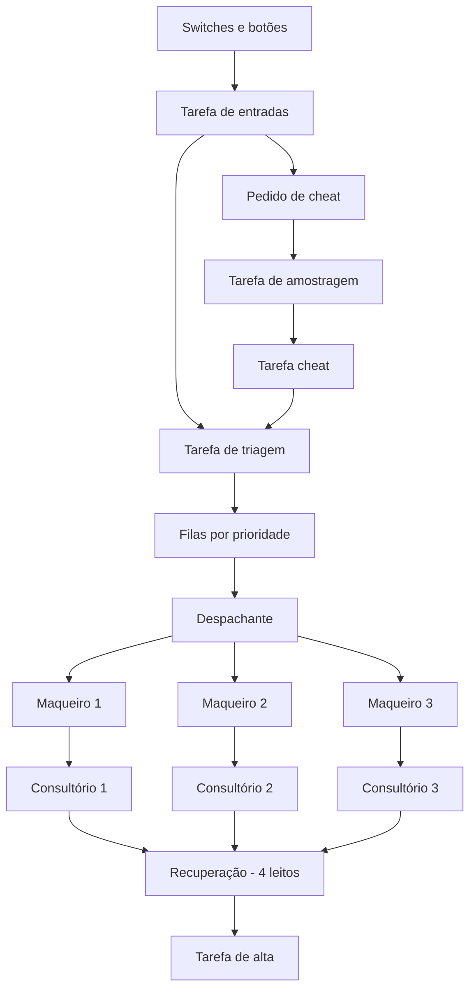

# Hospital Automatizado com ESP32 e FreeRTOS

## Visão geral

Este projeto implementa, no simulador **Wokwi**, um hospital automatizado executado em uma placa **ESP32 DevKit V1** com **FreeRTOS**.

O sistema possui:

- 3 consultórios;
- 3 maqueiros;
- 4 leitos de recuperação;
- triagem por prioridade;
- modos automático, manual e teste;
- sinalização por LEDs;
- sincronização do cheat com uma tarefa periódica.

## Simulador e montagem

A simulação foi desenvolvida no **Wokwi**. O arquivo `diagram.json` define o ESP32, switches, botões, LEDs, resistores e analisador lógico.


## Implementação

O sistema não utiliza um mutex global controlando todo o hospital. A comunicação entre as tarefas ocorre por:

- **filas:** pacientes, trabalhos, recursos livres e mensagens;
- **semáforo contador:** reserva e liberação dos quatro leitos;
- **Event Group:** estados dos consultórios e pedido de cheat;
- **notificações:** ativação do despachante, triagem, alta e cheat;
- **`vTaskDelayUntil()`:** tarefas periódicas de entrada, amostragem e sinalização.

Também foram implementados:

- uma fila individual para cada maqueiro;
- distribuição equilibrada dos transportes;
- debounce dos botões;
- envelhecimento de prioridade;
- logging assíncrono;
- monitor simples do estado do hospital.

## Arquitetura das tarefas



| Tarefa | Função |
|---|---|
| `tEntradas` | Lê switches e botões com debounce |
| `tTriagem` | Cria e classifica pacientes |
| `tDespachante` | Distribui transportes |
| `tMaqueiro` | Executa os transportes |
| `tConsultorio` | Realiza os atendimentos |
| `tAlta` | Libera pacientes da recuperação |
| `tAmostragem` | Gera o pulso periódico |
| `tCheat` | Executa o cheat sincronizado |
| `tSinalizacao` | Atualiza os LEDs |
| `tLogger` | Envia mensagens ao monitor serial |
| `tMonitor` | Exibe o estado geral do sistema |

## Modos de operação

| Modo 1 | Modo 0 | Funcionamento |
|---:|---:|---|
| 0 | 0 | Automático |
| 0 | 1 | Manual |
| 1 | 0 | Teste/Cheat |
| 1 | 1 | Reservado |

### Automático

Pacientes e altas são gerados em intervalos aleatórios.

### Manual

O botão `PACIENTE` gera uma nova entrada e o botão `ALTA` libera um paciente da recuperação.

### Teste/Cheat

O botão `CHEAT` solicita um paciente vermelho de prioridade máxima.

## Sincronização do cheat com a amostragem

O cheat não é executado diretamente no instante do botão.

1. A tarefa de entradas registra `BIT_CHEAT` no `Event Group`.
2. A tarefa de amostragem executa periodicamente com `vTaskDelayUntil()`.
3. No pulso seguinte, ela detecta o bit e notifica `tCheat`.
4. `tCheat` solicita a criação do paciente vermelho na triagem.

```text
Botão CHEAT
    ↓
BIT_CHEAT pendente
    ↓
Próximo pulso de amostragem
    ↓
Notificação de tCheat
    ↓
Paciente vermelho inserido
```

O analisador lógico monitora:

- pedido do cheat;
- pulso de amostragem;
- execução do cheat.

## Triagem e envelhecimento de prioridade

| Cor | Prioridade |
|---|---:|
| Vermelho | 1 |
| Laranja | 2 |
| Azul | 3 |

Para impedir espera indefinida:

- azul passa a laranja após 15 s;
- azul passa a vermelho após 30 s;
- laranja passa a vermelho após 20 s.

## Evidências dos três modos

## Modo manual

O modo manual permite controlar diretamente a entrada e a saída de pacientes durante a simulação.

Nesse modo, os eventos automáticos de chegada e alta ficam desativados. O usuário controla o sistema pelos botões da montagem:

- `PACIENTE`: solicita a criação de um novo paciente na triagem;
- `ALTA`: remove um paciente da recuperação e libera um leito;
- `CHEAT`: não é executado no modo manual.

Quando o botão `PACIENTE` é pressionado, a tarefa `tEntradas` envia uma solicitação para a tarefa `tTriagem`. Em seguida, o paciente recebe uma classificação de prioridade e é colocado em uma das filas de atendimento.

Quando o botão `ALTA` é pressionado, a tarefa `tAlta` tenta retirar um paciente da recuperação. Caso exista um paciente internado, o leito correspondente é liberado no semáforo contador.

O modo manual é utilizado para testar o fluxo do hospital de maneira controlada, permitindo observar separadamente:

1. entrada do paciente;
2. triagem;
3. transporte pelo maqueiro;
4. atendimento no consultório;
5. transporte para a recuperação;
6. liberação do leito pela alta.

## Modo teste

O modo teste mantém os controles manuais e adiciona a função `CHEAT`.

Nesse modo, os botões possuem as seguintes funções:

- `PACIENTE`: solicita um paciente comum;
- `ALTA`: libera um paciente da recuperação;
- `CHEAT`: solicita um paciente vermelho com prioridade máxima.

O cheat não cria o paciente imediatamente. Quando o botão é pressionado, a tarefa `tEntradas` apenas registra uma solicitação pendente no `Event Group`, utilizando o bit `BIT_CHEAT`.

## Como executar

1. Crie um projeto **ESP32** no Wokwi.
2. Copie o conteúdo de `sketch.ino` para o editor de código.
3. Copie o conteúdo de `diagram.json` para o editor do circuito.
4. Inicie a simulação.
5. Selecione o modo pelos dois switches.
6. Utilize os botões conforme o modo selecionado.
7. Observe os LEDs, o monitor serial e o analisador lógico.

## Limitação

O Wokwi valida a lógica e a comunicação entre tarefas, mas não substitui completamente testes em um ESP32 físico.
